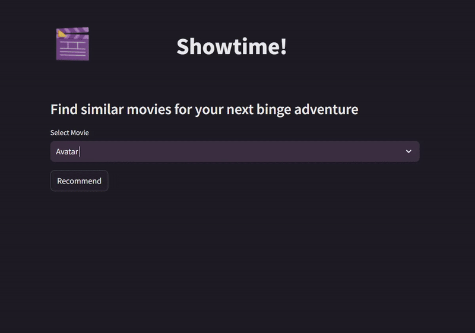

## Showtime! - Movie Recommendation App

Welcome to **Showtime!**, a movie recommendation app that helps you discover movies similar to your favorite ones. Powered by the Movie Database (TMDb) API, this app uses a movie recommendation model to suggest movies based on the one you select.

## Features

- **Movie Selection**: Choose a movie from a list of popular movies.
- **Recommendations**: Receive recommendations for similar movies based on the selected movie.
- **Posters**: View movie posters for all recommended movies.
- **Custom Styling**: The app is styled with custom CSS for a sleek and clean interface.

## How it Works

1. **Select a Movie**: From a dropdown list, select the movie you would like recommendations for.
2. **Get Recommendations**: Once you click "Recommend", the app will find movies similar to your selected one, display their posters, and show their names.
3. **Fetch Movie Posters**: The app fetches the movie posters from the TMDb API to enhance your movie discovery experience.

## Technology Stack

- **Streamlit**: For building the web interface.
- **Pickle**: For loading pre-computed movie data and similarity scores.
- **TMDb API**: For fetching movie posters and details.
- **Python Libraries**:
  - `requests`: For making HTTP requests to TMDb API.
  - `pickle`: For loading pre-processed movie data.
  - `dotenv`: For managing API keys securely.

## Preview

Here’s a preview of how the app works:



## Setup and Installation

Follow these steps to run the app locally:

### 1. Clone the repository:
```bash
git clone git@github.com:bshreya15/movie-recommender-system.git
cd movie-recommender-system
```

### 2. Set up the environment variables:
Create a .env file in the root directory and add your TMDb API key:
```bash 
tmdb_api_key=your_tmdb_api_key_here
```

### 3. Run the Streamlit app:
```bash
streamlit run app.py
```

## Files Description
- **app.py**: Main file containing the logic for the Streamlit app interface and interaction.
- **style.py**: Contains custom CSS for styling the app.
- **movies.pkl**: Pickled DataFrame containing movie metadata (like titles and movie IDs).
- **similarity.pkl**: Pickled matrix of movie similarity scores used for making recommendations.
- **.env**: Stores your TMDb API key securely.